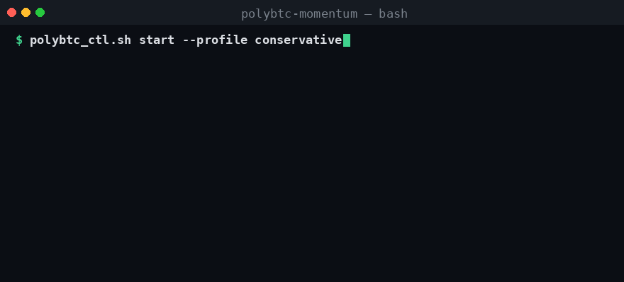
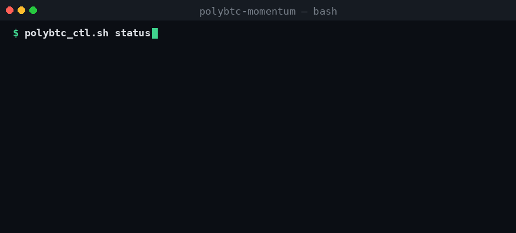

<div align="center">


# PolyBTC Momentum Skill

**Open-source OpenClaw skill for BTC 5-minute Up/Down momentum trading on Polymarket**

[](https://github.com/0xgetz/polymarket-btc-5m/actions/workflows/ci.yml)


[](https://saweria.co/0xgetz)

[**Repository**](https://github.com/0xgetz/polymarket-btc-5m)

</div>

---

## 🎬 Demo

### Live Trading Session (conservative profile)
<p align="center"></p>

> Resolve BTC 5m market → confirm move + skew → enter with momentum → managed exit before close.

### Status & PnL Report
<p align="center"></p>

---

## Strategy (Momentum into Close)
This skill is aligned with a short-horizon momentum strategy:

1. Trade BTC 5m event markets near expiry.
2. Main entry window: around **2 minutes left**.
3. Confirm that BTC has already moved by about **$70-$100** in the active interval.
4. Check market skew (crowd positioning). If flow supports the move direction, enter **with** momentum.
5. Typical sizing: around **50% of trading allocation** (user-defined risk tolerance).
6. Optional micro-hedge when skew is extreme (for example, 95/5): place a small opposite position ($1-$2 equivalent) to reduce tail risk.

This is a momentum-following approach, not a reversal strategy.

## 📊 Realistic Expectations — No Guaranteed Profit

This is a high-variance speculative strategy. **No setup can guarantee profit**,
and anyone promising a "99% win rate" is misleading you. The payoff is
asymmetric — you buy a side at price `p`, so your **break-even win-rate equals
`p`**: you must be right *more* than `p`% of the time just to avoid losing money.

| Entry price | Win payoff ($5 stake) | Loss | Break-even win-rate |
|---|---|---|---|
| 0.71 | +$2.04 | −$5.00 | **> 71%** |
| 0.90 | +$0.56 | −$5.00 | **> 90%** |
| 0.95 | +$0.26 | −$5.00 | **> 95%** |

At 0.71 a single loss erases ~2.4 wins. The realistic objective is a **measured,
positive edge with strict capital protection** — not guaranteed wins. Use the
analytics, edge, and guardrail tools (see [Tooling & Validation](#-tooling--validation))
to verify your real win-rate and block negative-expectation trades.

## Repository Structure
- `SKILL.md` — skill definition and operating rules
- `CONTOUR.md` — canonical execution path + post-audit safety notes
- `BACKTESTING.md` — CSV historical backtest guide
- `config/` — profiles and risk parameters (`polybtc_profiles.yaml` is the single source of truth)
- `scripts/` — runners/wrappers/hot commands + validation / live-safety helpers
  (`_psr_impl.py` is the plain monolithic live-session implementation)
- `examples/` — practical command examples + sample backtest CSV
- `assets/` — logo and demo GIFs
- `tests/` — pytest unit tests (config, preflight, edge, guardrails, analytics, dry-run, summary, live safety, backtest)
- `.github/workflows/` — CI (lint, compile, config validation, tests)

## Deploy / Run
### Prerequisites
- OpenClaw environment
- Polymarket execution stack available at:
  - `<your-workspace>/pm-hl-conservative-plus-repo`
- Python virtual env for runner scripts
- Valid API credentials configured outside this repository

### Quick Start
```bash
git clone https://github.com/0xgetz/polymarket-btc-5m.git
cd polymarket-btc-5m
```

Read:
- `SKILL.md`
- `config/polybtc_profiles.yaml`

Dry-run first (default — no orders):
```bash
.venv/bin/python scripts/test_polybtc_session_exit_sl.py --profile conservative
# or:
scripts/polybtc_ctl.sh start --profile conservative
# selective / higher quality filters (fewer trades — not a guaranteed 90% WR):
scripts/polybtc_ctl.sh start --profile high_confidence
```

Live only after validation (explicit flag required):
```bash
.venv/bin/python scripts/test_polybtc_session_exit_sl.py --profile conservative --execute
scripts/polybtc_ctl.sh start --profile conservative --live
```

Unified skill control (recommended):
```bash
scripts/polybtc_ctl.sh start --profile conservative          # dry-run
scripts/polybtc_ctl.sh start --profile conservative --live   # real orders
scripts/polybtc_ctl.sh status
scripts/polybtc_ctl.sh report --limit 20
scripts/polybtc_ctl.sh stop   # SIGTERM first; may leave open positions if killed mid-trade
```

### Live safety (post-audit)

Defaults and gates are designed so real money is hard to enable by accident:

| Control | Behavior |
|---|---|
| **Default mode** | Dry-run (no orders). Real placement needs `--execute` or `polybtc_ctl.sh --live`. |
| **Preflight gate** | Time-to-close, BTC impulse (Binance 5m candle), quote freshness, spread, liquidity, threshold side — **before** any open. |
| **Capital guardrails** | Consecutive-loss kill switch, daily max-loss %, max trades/day, optional EV/edge gate. |
| **Profile source** | `config/polybtc_profiles.yaml` only (via `polybtc_config`; no hardcoded live profile dict). |
| **Stop-loss mark** | CLOB **best bid** (executable exit), not Gamma mid prices. |
| **Close limit floor** | Force/GTC close cannot dump below `entry * (1 - max_close_slippage)` (no default 0.01 fire-sale). |
| **Open-order env** | Spread / top-ask notional guards stay on; values come from the profile (`PM_MAX_SPREAD`, `PM_MIN_TOP_ASK_NOTIONAL_USD`). |
| **Stop semantics** | `polybtc_ctl.sh stop` sends SIGTERM first (wait), then SIGKILL; lockfile + open-position warning. |
| **Watcher** | `watch_polybtc_threshold_and_enter.sh` defaults to dry-run, uses a lockfile, stops on guardrail block. |

Pure helpers live in `scripts/polybtc_live_safety.py` (unit-tested, no network). Live CLOB client deps are listed in `requirements-live.txt`.

Runtime isolation:
- skill runtime dir: `./runtime`
- auth/env source (default): `<your-workspace>/pm-hl-conservative-plus-repo/.env`
- overrides: `POLYBTC_REPO`, `POLYBTC_ENV_FILE`, `POLYBTC_RUNNER`
- completion auto-report cron (topic 184): `polybtc-completion-autoreport-topic184`

Optional Docker isolation:
```bash
scripts/polybtc_docker.sh up
scripts/polybtc_docker.sh status
scripts/polybtc_docker.sh down
```

## 🧪 Tooling & Validation

Two self-contained helper tools make the strategy testable and safe to tweak —
no network or order placement, fully deterministic.

### Config validator
Validates `config/polybtc_profiles.yaml` (schema + value ranges) and resolves a
flattened profile used across the codebase:

```bash
pip install -r requirements.txt
python scripts/polybtc_config.py --validate
python scripts/polybtc_config.py --profile conservative --show
```

### Preflight gate (Execution Checklist as code)
A GO / NO-GO decision engine implementing the checklist below. Feed it a market
snapshot and it returns the chosen side, recommended stake, stop-loss price,
optional near-close micro-hedge, and per-check pass/fail reasons:

```bash
python scripts/polybtc_preflight.py --profile conservative \
  --seconds-left 118 --btc-move-usd 84 \
  --up-ask 0.71 --dn-ask 0.29 \
  --spread 0.02 --top-ask-notional 41 --quote-age-sec 1
```

Example output (exit code `0` = GO, `1` = NO-GO):

```json
{ "ok": true, "side": "UP", "entry_price": 0.71, "stake_usd": 5.0,
  "stop_loss_price": 0.5325, "hedge": null,
  "checks": { "time_to_close": true, "impulse_move": true, "quote_fresh": true,
              "spread": true, "liquidity": true, "threshold_side": true } }
```

### Trade analytics / log backtest
Measure the **real** win-rate, expectancy, profit factor, max drawdown, and
streaks from your runtime logs — the only honest way to know whether the edge is
positive before sizing up:

```bash
python scripts/polybtc_analytics.py --runtime-dir ./runtime --limit 200
python scripts/polybtc_analytics.py --breakeven   # break-even win-rate per price
```

### Capital-protection guardrails
Consecutive-loss kill switch, daily max-loss cap, trade ceiling, and a
positive-edge gate. Replay PnLs to see exactly when trading gets blocked:

```bash
python scripts/polybtc_guardrails.py --profile conservative \
  --equity 200 --pnls=-5,-5,-5 --entry 0.71 --win-prob 0.80
```

### Live safety helpers (unit-testable)
Close-limit floor, open-order env (never disables spread/liquidity), stop-loss
price math, and guard-state builders shared by the live runner:

```bash
# covered by tests/test_live_safety.py — no network
pytest tests/test_live_safety.py -q
```

### Edge / break-even calculator
```bash
python scripts/polybtc_edge.py --entry 0.71 --win-prob 0.80 --stake 5
python scripts/polybtc_edge.py --table
```

### Dry-run (paper trading)
Run the **same decision logic as live but place no order** — record simulated
trades in the same log format, so the analytics/summary tools work identically.
Record each resolved 5m market:

```bash
python scripts/polybtc_dryrun.py --profile conservative \
  --seconds-left 118 --btc-move-usd 84 \
  --up-ask 0.71 --dn-ask 0.29 --spread 0.02 \
  --top-ask-notional 41 --quote-age-sec 1 \
  --market-slug btc-updown-5m-1430 --outcome win
```
`--outcome` is the resolved result: `win` / `loss`, or the winning side
`UP` / `DOWN`. Paper logs land in `runtime/` (gitignored). **Validate the real
edge over several days before risking money** — at break-even 0.71 even a 67%
win-rate still loses money.

### Automated daily summary
Aggregate a day's logs (paper or live) into a digest — win-rate, net PnL,
profit factor, drawdown, and risk-limit flags:

```bash
python scripts/polybtc_daily_summary.py --profile conservative --equity 200
```
Automate it with cron via the wrapper (writes Markdown to `runtime/daily/` and
can POST to a Slack / Discord / Telegram webhook):

```bash
# every day at 00:10 UTC, summarise the previous day
10 0 * * * /path/to/polymarket-btc-5m/scripts/polybtc_daily_cron.sh >> /tmp/polybtc_daily.log 2>&1
```
Optional env overrides: `POLYBTC_PROFILE`, `POLYBTC_EQUITY`, `POLYBTC_WEBHOOK`.

### Tests & CI
```bash
pip install -r requirements-dev.txt
pytest -q          # unit tests: config, preflight, edge, guardrails, analytics, dry-run, summary, live safety
```
CI runs bash/Python syntax checks, config validation, and the test suite on
every push and pull request.

## Execution Checklist (Before Live Trade)
Use this quick pre-flight checklist before any real order:

1. **Market validity**
   - Confirm the BTC 5m market is active and not about to close unexpectedly.
2. **Time-to-close window**
   - Prefer entries around ~120 seconds left (with reasonable tolerance).
3. **Impulse confirmation**
   - Confirm the observed BTC move is meaningful (strategy reference: ~$70-$100).
4. **Skew confirmation**
   - Verify market skew supports the intended direction (do not fade strong momentum by default).
5. **Liquidity/spread checks**
   - Ensure spread and top-of-book notional pass your minimum thresholds.
6. **Sizing guardrails**
   - Validate stake, max notional, and daily loss limits before execution.
7. **Stop / exit controls**
   - Confirm stop-loss and `exit_before_sec` are configured.
8. **Execution mode**
   - Start in dry-run when changing parameters; switch to `--execute` only after validation.

## Risk Controls Template
Suggested baseline controls (adapt to your risk profile; defaults live in
`config/polybtc_profiles.yaml` and are enforced on the live path):

- **Per-trade risk cap**: 1%-15% of account equity (profile dependent)
- **Daily max loss**: hard stop at 10%-15%
- **Max consecutive losses**: kill switch (e.g. 3 conservative / 5 aggressive)
- **Max trades/day**: fixed ceiling to avoid overtrading
- **Max notional/trade**: strict upper bound
- **Quote staleness guard**: skip if market data is stale
- **Spread guard**: skip when spread exceeds threshold (also applied to child open-order env)
- **Liquidity guard**: skip when top ask/bid notional is too thin
- **Stop-loss on executable bid**: mark SL off CLOB best bid; close limit respects slippage floor
- **Extreme skew hedge**: optional small opposite hedge in 95/5-type scenarios
- **Operational kill switch**: immediate stop on repeated API/DNS/execution failures
- **Graceful process stop**: SIGTERM → wait → SIGKILL; do not assume positions are flat after `stop`

## 💖 Dukung Proyek Ini

Jika skill ini bermanfaat untuk trading atau riset Anda, dukung pengembangannya:

<div align="center">

[](https://saweria.co/0xgetz)

</div>

Donasi membantu untuk:
- 🖥️ Biaya server & data feed untuk pengujian strategi
- ✨ Pengembangan fitur baru (filter impulse, multi-market, dashboard)
- 📚 Dokumentasi & contoh penggunaan yang lebih lengkap
- 🐛 Perbaikan bug dan pemeliharaan rutin

🔗 **https://saweria.co/0xgetz**

## Risk Notice
This repository is educational/operational infrastructure, not financial advice.
Use your own risk limits, daily loss caps, and capital controls.

## Contributing
- Fork the repository
- Create a feature branch
- Commit changes
- Open a PR to `main`

PRs are welcome.
